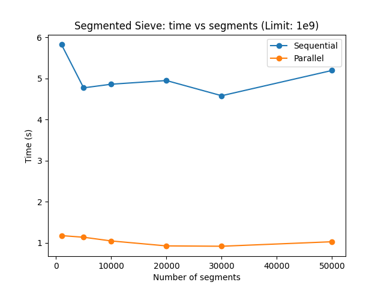

# Parallel segmented sieve

Parallel segmented sieve in rust, for practice with rayon and clap.

In a multicore programming course I took, I coded a parallel sieve using the rust standard library threading library. This code improves upon the original code I wrote by using the rayon library, and showing benchmarks against the primality method and sequential variants.


## Results

### Timing algorithms

```
Benching for primes up to 1000000

Sequential primality: 21.01423
Parallel primality: 3.2719522
Sieve of Eratosthenes: 0.004974149
Sequential segmented sieve: 0.034614135
Parallel segmented sieve: 0.005703297
```

### Timing segmented sieve with varying number of segments



## Compile

```
cargo build --release
```

## Usage

```
pseg-sieve 0.1.0
Calvin
Parallel segmented sieve with benchmarks

USAGE:
    pseg-sieve <SUBCOMMAND>

FLAGS:
    -h, --help       Prints help information
    -V, --version    Prints version information

SUBCOMMANDS:
    bench-algs         Benchmark primality algs and sieves
    bench-seg-sieve    Benchmark segmented sieve varying number of segments
    help               Prints this message or the help of the given subcommand(s)
    run                Run the parallel segmented sieve
```


To run the parallel segmented sieve with defaults (limit 1 billion, 20000 segments)

```
target/release/pseg-sieve run
```

Benchmark the parallel segmented sieve with other algorithms

```
target/release/pseg-sieve bench-algs
```

Benchmarking the segmented sieve, varying the number of segments. This prints out results in a csv format.

```
target/release/pseg-sieve bench-seg-sieve
```

Make a plot for the segmented sieve results

```
python scripts/plot.py $(target/release/pseg-sieve bench-seg-sieve)
```
